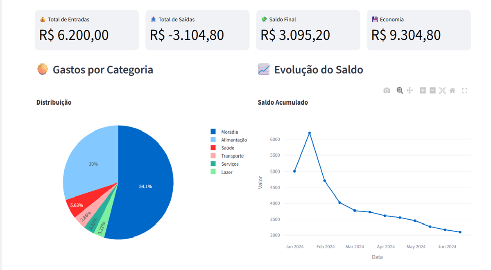
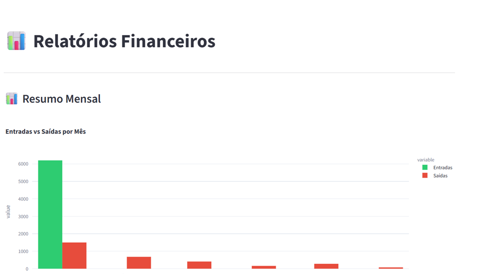
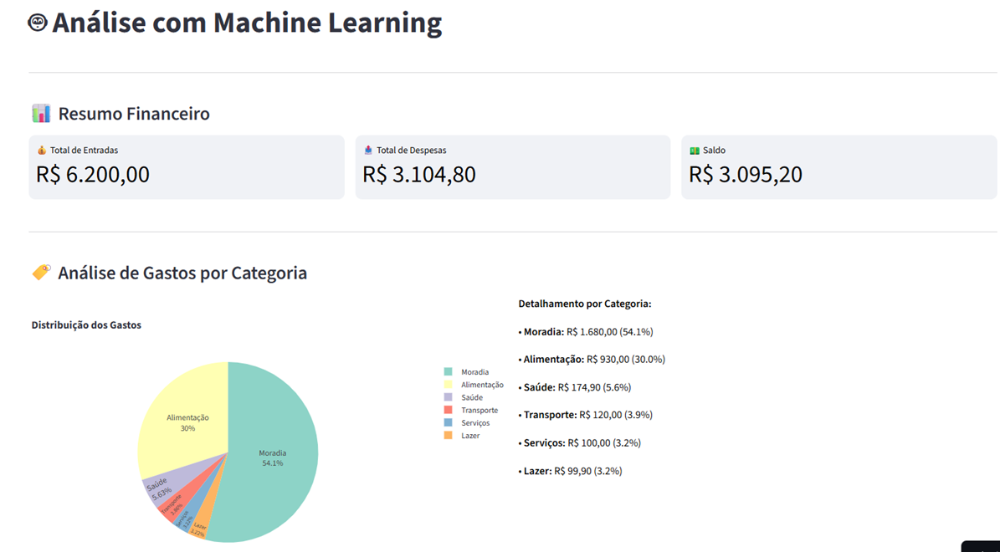

# 🧠 AdaptFin - Assistente Financeiro Adaptativo

> **"Em vez de você se adaptar ao app, o app se adapta a você."**

🚀 **Demonstração Online:** https://adaptfin-demo.streamlit.app

👨‍💻 **Desenvolvido por:** Cleber Ramos Oliveira

🔗 **LinkedIn:** https://www.linkedin.com/in/cleber-ramos-oliveira-00035a397/

---

# 📌 Sobre o Projeto

O AdaptFin é um assistente financeiro inteligente desenvolvido em Python com foco em análise financeira, visualização de dados e experiência do usuário.

Diferente de aplicativos tradicionais de controle financeiro, o AdaptFin busca adaptar-se ao comportamento do usuário, oferecendo insights e informações que auxiliam na tomada de decisões financeiras.

O projeto foi desenvolvido como aplicação prática de conceitos de:

* Desenvolvimento de Software
* Análise de Dados
* Machine Learning
* Arquitetura de Sistemas
* Visualização de Dados
* Experiência do Usuário

---

# 📸 Screenshots

## 🏠 Dashboard Principal



---

## 💳 Gestão de Transações


---

## 📊 Relatórios Financeiros



---

## 🤖 Machine Learning e Insights



---

# 🎯 Problema Resolvido

A maioria dos aplicativos financeiros exige configuração manual, categorização constante e acompanhamento disciplinado.

Muitos usuários abandonam esses aplicativos após poucas semanas de uso.

O AdaptFin foi desenvolvido para simplificar esse processo e fornecer uma experiência mais intuitiva para acompanhamento financeiro.

---

# 💡 Solução

| Problema                           | Solução AdaptFin                           |
| ---------------------------------- | ------------------------------------------ |
| Configuração complexa              | ✅ Interface simples e intuitiva            |
| Falta de organização financeira    | ✅ Centralização de receitas e despesas     |
| Pouca visibilidade dos gastos      | ✅ Dashboards e relatórios visuais          |
| Dificuldade em identificar padrões | ✅ Insights financeiros inteligentes        |
| Dados dispersos                    | ✅ Persistência local e exportação de dados |

---

# ✨ Funcionalidades

## 📊 Dashboard Interativo

* Indicadores financeiros
* Métricas em tempo real
* Gráficos dinâmicos
* Evolução financeira

## 💰 Controle Financeiro

* Cadastro de receitas
* Cadastro de despesas
* Controle de transações
* Histórico financeiro

## 📈 Relatórios

* Relatórios mensais
* Relatórios anuais
* Gastos por categoria
* Análises comparativas

## 🤖 Insights Inteligentes

* Análise de padrões financeiros
* Identificação de tendências
* Recomendações financeiras
* Informações para tomada de decisão

## 💾 Persistência de Dados

* SQLite
* Exportação de dados
* Backup local
* Armazenamento seguro

---

# 🛠️ Tecnologias Utilizadas

## Linguagem

* Python

## Framework

* Streamlit

## Banco de Dados

* SQLite

## Análise de Dados

* Pandas

## Visualização de Dados

* Plotly

## Machine Learning

* Scikit-Learn

## Versionamento

* Git
* GitHub

---

# 🏗️ Arquitetura do Projeto

```text
Usuário
   │
   ▼
Interface Streamlit
   │
   ▼
Components
   │
   ▼
Services
   │
   ▼
SQLite Database
   │
   ▼
Analytics & Machine Learning
```

## Estrutura de Pastas

```text
adaptfin/
│
├── assets/
├── cache/
├── components/
├── data/
├── pages/
├── reports/
├── services/
├── src/
├── utils/
│
├── app.py
├── requirements.txt
└── README.md
```

---

# 💼 Competências Demonstradas

Este projeto demonstra conhecimentos em:

* Desenvolvimento de aplicações Python
* Programação orientada a objetos
* Arquitetura modular
* Desenvolvimento com Streamlit
* Banco de dados SQLite
* Manipulação de dados com Pandas
* Visualização de dados com Plotly
* Versionamento com Git e GitHub
* Estruturação de projetos reais
* Conceitos de Machine Learning
* Boas práticas de desenvolvimento

---

# 🚀 Possíveis Evoluções

* Integração com APIs bancárias
* Aplicativo Mobile
* Dashboard Web Multiusuário
* Integração com IA Generativa
* Hospedagem em Cloud
* Sistema de metas financeiras inteligentes

---

# 📄 Observação

Esta versão foi disponibilizada para fins de demonstração técnica e portfólio profissional.

Algumas funcionalidades avançadas, componentes proprietários e recursos experimentais podem não estar presentes nesta versão pública.

---

# 👨‍💻 Autor

### Cleber Ramos Oliveira

Estudante de Análise e Desenvolvimento de Sistemas (ADS)

🔗 LinkedIn:
https://www.linkedin.com/in/cleber-ramos-oliveira-00035a397/

🔗 GitHub:
https://github.com/cleberramoscria-hue

---

⭐ Se este projeto foi interessante para você, considere deixar uma estrela no repositório.
